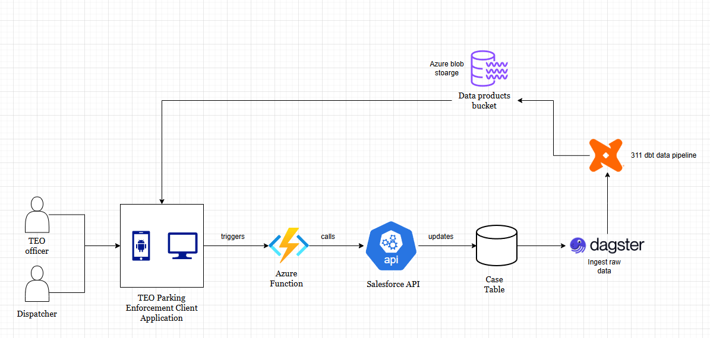
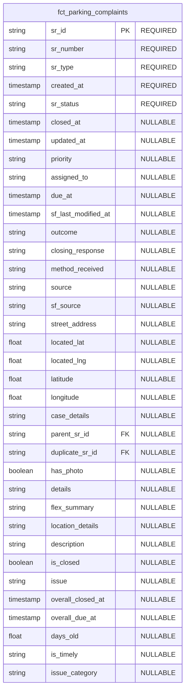

# Summary
This proposal outlines the back end integration to support the client side TEO Parking Buddy app. This client side app will be used by an estimated one hundred users and should support concurrent write and updates to the Salesforce API triggered by actions from on the field TEO officers and DOT dispatchers. 

# Motivation
As part of the Parking Enforcement Tiger Team, we're piloting a client side application to help identify open parking enforcement service requests (SRs) displayed through an interactive map. Both traffic enforcement officers (TEOs) and dispatchers alike would be able to interact with the app and do things such as: 
- See all open and recent parking enforcement service requests.
- Close a service request with a given reason such as gone at arrival (GOA)
- Edit service request details directly
- Retrieve and download a list of open SRs in a given area (post)

## Front End Application
- [TEO Parking Buddy](https://github.com/balt-opi/TEOParkingBuddy)

## Why is This Needed? 
DOT and TEO officers currently use a Salesforce worker app that is supposed to help them both view and close out parking related service requests while they're on the field. Not only does this current solution not work as expected, TEO officers often bypass using the app and instead default to internal workflows (which vary depending on the TEO). This misalignment results in a loss of visibility into certain parts of the service request lifecycle and results in duplicate SRs being filed as a direct result. All of these issues stem from the current worker app not meeting the current demand 

## Solution
In an effort to support these functionalities, this RFC outlines a system that leverages Azure functions (serverless compute), the Salesforce API, Azure blob storage, and Dagster to orchestrate a 311 dbt data pipeline to power the back end requirements of the TEO Parking Buddy application. This RFC proposes the introduction of a new micro service repository responsible for handling CRUD operations to interact directly with the Salesforce API through the use of serverless Azure functions. 

## System Design Architecture


## Data Models
The production client side app will be pulling from a parquet stored in `dataproudctsdev/311/fct_parking_complaints.parquet`. 
The data model for this dataset is:



This parquet will be generated as a downstream asset from the following data pipeline workflow:

```mermaid
flowchart LR
  subgraph dbt["🔧 dbt"]
    A([sf_service_requests]) --> B[stg_sf_service_requests]
    B --> C[dim_service_requests]
    C --> D[fct_parking_complaints]
  end

  subgraph dagster[🐙 dagster"]
    E[(fct_parking_complaints.parquet)]
  end

  D --> E
```


# Open Questions

> Raise any concerns here for things you aren't sure about yet.


# Answered Questions

> If there were any major concerns that have already (or eventually, through
> the RFC process) reached consensus, it can still help to include them along
> with their resolution, if it's otherwise unclear.
>
> This can be especially useful for RFCs that have taken a long time and there
> were some subtle yet important details to get right.
>
> This may very well be empty if the proposal is simple enough.


# New Implications

> What is the impact of this change, outside of the change itself? How might it
> change peoples' workflows today, good or bad?
