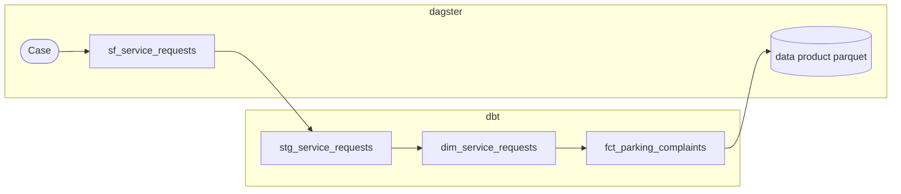
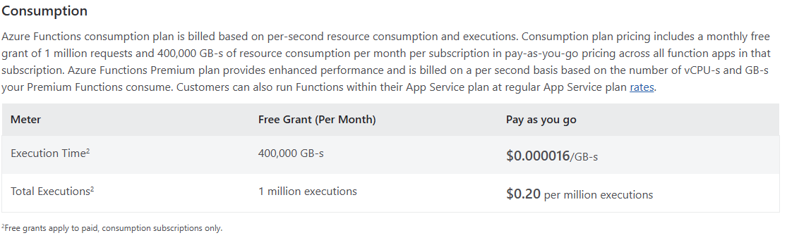
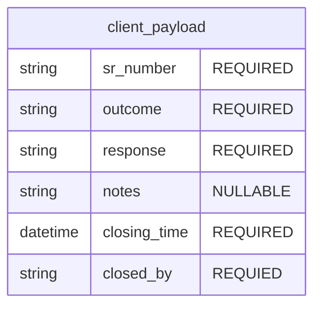
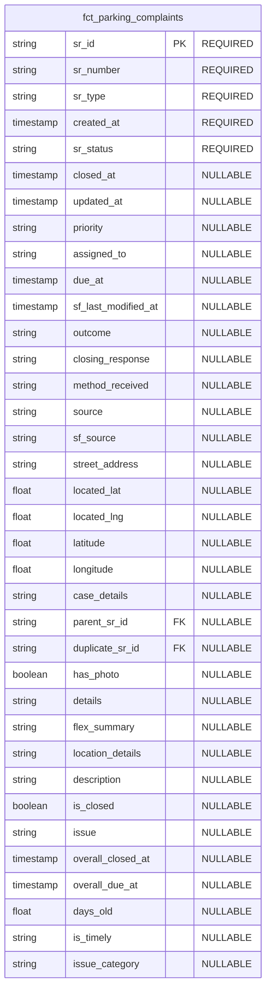

# Summary
This proposal outlines the backend integration required to support the TEO Parking Buddy client application. The app will serve an estimated one hundred concurrent users, supporting real-time writes and updates to the Salesforce API triggered by actions from TEO officers and DOT dispatchers in the field.

# Motivation
As part of the Parking Enforcement Tiger Team, we are piloting a client application to help identify open parking enforcement service requests (SRs) via an interactive map. Both traffic enforcement officers (TEOs) and DOT dispatchers would be able to:

- View all open and recent parking enforcement service requests
- Close a service request with a given outcome (e.g., gone on arrival)
- Edit service request details directly
- Retrieve and download a list of open SRs within a given area

## Front-End Application
- [TEO Parking Buddy](https://github.com/balt-opi/TEOParkingBuddy)

## Why Is This Needed?
DOT and TEO officers currently use a Salesforce worker app intended to help them view and close parking-related service requests while in the field. Not only does this solution not work as expected, but TEO officers frequently bypass it in favor of informal, individual workflows. This misalignment reduces visibility into the service request lifecycle and contributes directly to duplicate SRs being filed — both of which are factors in the systemic backlog that has accumulated over time.

## Solution
To support these requirements, this RFC proposes a system leveraging Azure Functions (serverless compute), the Salesforce API, Azure Blob Storage, and Dagster to orchestrate a 311 dbt data pipeline powering the backend of the TEO Parking Buddy application. This requires introducing a new microservice repository responsible for handling CRUD operations against the Salesforce API via serverless Azure Functions.

## System Design Architecture


## End-to-End Data Flow

The source of truth for city-wide service requests is the operational database table `balt-sql311-prd.baltimore.city.BALT_SALESFORCE.dbo.Case`, owned and maintained by Salesforce and the corresponding 311 BCIT partners. A dbt pipeline transforms this source into a downstream fact table consumed by the TEO Parking Buddy client application.

To maximize efficiency, the pipeline leverages Parquet's columnar storage format, delivering file snapshots to an Azure storage container at `dataproudctsdev/311/fct_parking_complaints.parquet`. The pipeline targets near-real-time freshness with updates every 2 minutes.



## Azure Function Architecture
The microservice exposes two HTTP-triggered Azure Functions responsible for mutating service request state in Salesforce. Both functions accept JSON payloads to properly process update or close service request event triggers.

Here is a snippet of the high level structure the functions would have:
```python
import azure.functions as func
import logging

app = func.FunctionApp(http_auth_level=func.AuthLevel.FUNCTION)


@app.route(route="sr/{sr_id}", methods=["PATCH"])
def update_sr(req: func.HttpRequest) -> func.HttpResponse:
    """Update editable fields on an open service request."""
    ...


@app.route(route="sr/{sr_id}/close", methods=["POST"])
def close_sr(req: func.HttpRequest) -> func.HttpResponse:
    """Close a service request with a given outcome."""
    ...
```

Request validation should reject payloads missing required fields and return a 400 with a descriptive error before any Salesforce API call is attempted.

## Observability & Monitoring
Azure Functions on the Consumption plan integrate natively with Application Insights, which should be enabled on both the dev and prod function apps. This gives us out-of-the-box coverage for logs, invocation counts, failure rates, cold-start latency, and end-to-end request duration without any additional instrumentation.

Alerts should be configured for two scenarios: a sustained spike in 5xx responses (indicating a Salesforce API or auth issue) and invocation latency exceeding a reasonable threshold (e.g., p95 > 3s), which would signal cold-start problems or Salesforce throttling. Both can be set up as Azure Monitor alert rules tied to the Application Insights resource.

## Cost Breakdown
Some quick back of the envelope calculations can help us understand what associated costs we'll incur with the given system design. If we're estimating to have 100 users that each make 150 updates (function invocations) / day on the TEO Parkig Buddy app, our total function invocations per month comes out to:
```
100 users × 150 requests/day × 30 days = 450,000 executions/month
```

Given the [Azure Function Princing Table](https://azure.microsoft.com/en-us/pricing/details/functions/#pricing), if we go with the base consumption plan, we'd get 1 million free executions per month. Given that they payload the function is accepting doesn't have batch aggregate data, we also fall well within the free tier for the 400,000 GB-s usage consumption. 

Here is the pricing table for reference:



## Testing & Deployment

### Environments
The function app should be deployed to two isolated Azure subscriptions: dev and prod. The dev environment serves as the integration target for the TEO Parking Buddy client during development and QA — it points at a Salesforce sandbox so writes are safe to exercise freely. Prod points at the live Salesforce org and is only deployed to after changes have been validated in dev.

Each environment gets its own function app, Key Vault, and Application Insights instance. Environment-specific configuration (Salesforce credentials, API base URLs) lives in each function app's application settings, populated by OpenTofu at deploy time.

### Infrastructure as Code (IAC) with OpenTofu
Managing both environments through OpenTofu ensures parity between dev and prod and eliminates manual resource drift. More importantly, because the function app's deployment source can be defined in the OpenTofu configuration itself, a change to the Python code triggers a redeployment when tofu apply runs — OpenTofu detects that the packaged zip has changed and updates the function app accordingly.

A minimal OpenTofu configuration for provisioning a function app looks like this:

```hcl
resource "azurerm_resource_group" "teo" {
  name     = "rg-teo-parking-${var.environment}"
  location = var.location
}

resource "azurerm_storage_account" "func_storage" {
  name                     = "stteofunc${var.environment}"
  resource_group_name      = azurerm_resource_group.teo.name
  location                 = azurerm_resource_group.teo.location
  account_tier             = "Standard"
  account_replication_type = "LRS"
}

resource "azurerm_service_plan" "consumption" {
  name                = "asp-teo-${var.environment}"
  resource_group_name = azurerm_resource_group.teo.name
  location            = azurerm_resource_group.teo.location
  os_type             = "Linux"
  sku_name            = "Y1" # Consumption plan
}

resource "azurerm_linux_function_app" "teo_api" {
  name                       = "func-teo-parking-${var.environment}"
  resource_group_name        = azurerm_resource_group.teo.name
  location                   = azurerm_resource_group.teo.location
  service_plan_id            = azurerm_service_plan.consumption.id
  storage_account_name       = azurerm_storage_account.func_storage.name
  storage_account_access_key = azurerm_storage_account.func_storage.primary_access_key

  site_config {
    application_stack {
      python_version = "3.11"
    }
  }

  app_settings = {
    "APPINSIGHTS_INSTRUMENTATIONKEY" = azurerm_application_insights.teo.instrumentation_key
    "SF_KEY_VAULT_URI"               = azurerm_key_vault.teo.vault_uri
  }

  zip_deploy_file = var.function_zip_path
}
```
The zip_deploy_file argument is the key piece — it points at the packaged function code. When the zip hash changes between applies, OpenTofu redeploys the function app. In CI, the workflow packages the code, runs tofu plan to preview the diff, and then tofu apply on merge to main (prod) or on push to a dev branch (dev).

### Testing Strategy
Unit tests should cover request validation and the Salesforce payload construction logic in isolation, mocking the Salesforce HTTP client. Integration tests in the dev environment should exercise the full round-trip against the Salesforce sandbox — issue an update via the function's HTTP endpoint and then read back the Case via the Salesforce API to confirm the mutation landed.

## Data Models

### client payload


### fct_parking_complaints



## Alternatives Considered
The most natural alternative to Azure Functions would be a standalone FastAPI service. The two endpoints `PATCH /sr/{sr_id}` and `POST /sr/{sr_id}/close` map cleanly to FastAPI route definitions and can even be integrated directly within the TEO parking buddy app. This solution however does not scale as well as Azure functions and we would be constrained by the CPU, RAM, and specs of the box or service we end up deploying fast api to. I wanted to build a solution that would handle 100+ users, each making 150 updates daily, feel like a breeze! 

# Open Questions

> Raise any concerns here for things you aren't sure about yet.

1) Identify TEO business needs first. Garner business requirements. 
2) TBD
3) TBD


# Answered Questions

> If there were any major concerns that have already (or eventually, through
> the RFC process) reached consensus, it can still help to include them along
> with their resolution, if it's otherwise unclear.
>
> This can be especially useful for RFCs that have taken a long time and there
> were some subtle yet important details to get right.
>
> This may very well be empty if the proposal is simple enough.


# New Implications

> What is the impact of this change, outside of the change itself? How might it
> change peoples' workflows today, good or bad?

This new microservice will need to be both owned and maintained by the OPI engineering team. 
