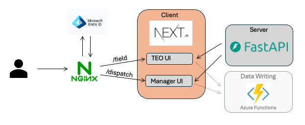

# RFC: Parking Enforcement Management App

# Summary

This proposal outlines the technical architecture and implementation to
support the Parking Enforcement Management application. The app serves
traffic enforcement officers (TEOs) in the field, TEO managers, and DOT
dispatchers, to meet their independent but overlapping requirements. The
application targets an estimated 100 concurrent users across mobile and
desktop form factors. It supports near-real-time reads of parking
enforcement service requests (SRs) and direct writes back to Salesforce
triggered by field actions.

The proposed client is a containerized Next.js/FastAPI application
deployed behind an Nginx reverse proxy. It will read a curated parking
complaint dataset snapshot stored and refreshed in Azure Blob Storage
parquet. 311 parking complaint data in salesforce will be updated from
the app via the open311 api connected to salesforce.

# Motivation

Traffic enforcement officers currently rely on a combination of radio
dispatch, paper logs, and disconnected legacy tools to receive
assignments and track their work. This creates visibility gaps for
supervisors, delays in officer response, and inconsistent documentation
of enforcement activity.

The TEO Parking Buddy app centralizes assignment management, real-time
SR visibility, and enforcement documentation into a single platform. The
backend integration described here is what makes that platform reliable
and authoritative — writes go directly to Salesforce rather than through
a reconciliation-dependent intermediary, and the read pipeline delivers
fresh data on a cadence that matches field workflows.

## User Personas

The app serves four distinct user types. The TEO is the primary user;
all features must be designed to support them first.

| Persona | Context | Primary Needs |
|--------------------|--------------------|--------------------------------|
| **TEO (Traffic Enforcement Officer)** | Mobile, in the field | Fast access to SRs in their post and queue; nearby open SRs; simple SR closure with outcome and notes |
| **Dispatcher** | Desktop, central office | Live map of all open SRs; assignment status; geographic distribution of requests |
| **Manager** | Desktop | TEO bandwidth visibility; ability to plan and make bulk assignments |
| **Admin Staff** | Desktop, support role | Data entry and corrections to maximize TEO efficiency |

## Front-End Application

-   [TEO Parking Buddy](https://github.com/balt-opi/TEOParkingBuddy)

## Why Is This Needed?

DOT and TEO officers currently use a Salesforce worker app intended to
help them view and close parking-related service requests while in the
field. Not only does this solution not work as expected, but TEO
officers frequently bypass it in favor of informal, individual
workflows. This misalignment reduces visibility into the SR lifecycle,
contributes directly to duplicate SRs being filed, and makes it
impossible to attribute closed SRs to the responsible officer — all of
which compound the systemic backlog.

The TEO Parking Buddy app was built to address this. Its current write
path logs SR closures to a SharePoint list ("Srs In Queue") as an
interim solution. This creates a secondary source of truth that must be
reconciled with Salesforce and introduces operational risk: if the
SharePoint-to-Salesforce sync breaks or lags, field closures are
invisible to the rest of the city's 311 workflows. It also makes the 90%
attribution goal unmeasurable until closures actually land in
Salesforce.

## Version 1.0 Scope

**In scope:** - Mobile-friendly webapp for TEOs in the field - Desktop
view for dispatchers and managers - GPS and mapping features for both
field and dispatch/manager views - Near real-time sync with 311 /
Salesforce data - Outcome, response, and notes captured in 311 via the
app - Bulk assignment and unassignment of SRs

**Explicitly out of scope for v1.0:** - Overtime metrics and KPI
dashboarding - Closing or editing SRs on behalf of other users -
Close-transfer options beyond the existing resolution options

## Solution

This RFC proposes a system leveraging Azure Functions (serverless
compute), the Salesforce API, Azure Blob Storage, and Dagster to
orchestrate a 311 dbt data pipeline powering the backend of the TEO
Parking Buddy application. This requires introducing a new microservice
repository responsible for handling CRUD operations against the
Salesforce API via serverless Azure Functions, replacing the current
SharePoint intermediary write path.

## System Design Architecture

### Web Server and Auth— Nginx

Nginx serves as the entry point for all incoming traffic, acting as a
high-performance reverse proxy that routes requests to the appropriate
service. Its lightweight and the standard for handling high concurrency
traffic. Routing rules separate frontend and API traffic: requests
to `/api/*` are proxied to the FastAPI backend, and all other requests
are forwarded to the Next.js server. Authentication requests are routed
to Microsoft Entra ID, delegating the full OAuth 2.0 flow — including
token issuance and refresh — to Entra's identity platform. This keeps
authentication logic out of the application layer entirely, with Nginx
enforcing redirect rules to Entra for any unauthenticated request before
it reaches either service. Nginx will pass user information as well as
path to Next.js to adjust UI and identify user.

### Frontend — Next.js

Next.js is a production-grade framework trusted at scale by some of the
largest applications on the web, making it a strong foundation for a
system. React frameworks, especially this one, are common thus can be
easily interpreted and edited by engineers and AI agents.

### Read Backend — FastAPI

The backend for serving data is powered by FastAPI, a modern Python
framework. FastAPI's async features allow it to handle many concurrent
requests efficiently, and its automatic OpenAPI documentation makes the
API immediately explorable and easy to validate during development. This
backend will read the blob-stored parquet file with parking complaint SR
data, refreshing regularly and storing in memory for serving the client.

### Write Backend — Azure Functions

The application will also update service request records in salesforce
via the Open311 api. This functionality will utilize Azure Functions and
is discussed in a separate rfc.

## Data Flow Overview

text goes here

## User considerations that influence architecture

The existing FastAPI backend reads this parquet file on a 2-minute
APScheduler interval, transforms it into GeoJSON keyed by user role, and
caches the result in memory. Two role-differentiated endpoints are
served from this cache:

-   **`GET /api/field/srs`** — filtered to unripe, unresolved SRs for
    the TEO mobile view; excludes SRs already closed in the current
    session
-   **`GET /api/dispatch/srs`** — full dataset with enriched properties
    (Salesforce deep links, portal links, issue categorization, ripe
    status) for the dispatcher and manager desktop views

Write operations — SR closures and field updates — flow in the opposite
direction: from the app through the FastAPI backend to an Azure
Function, which mutates the `Case` record in Salesforce directly.

## Observability & Monitoring

Azure Functions on the Consumption plan integrate natively with
Application Insights, which should be enabled on both the dev and prod
function apps. This gives us out-of-the-box coverage for logs,
invocation counts, failure rates, cold-start latency, and end-to-end
request duration without any additional instrumentation.

Alerts should be configured for two scenarios: a sustained spike in 5xx
responses (indicating a Salesforce API or auth issue) and invocation
latency exceeding a reasonable threshold (e.g., p95 \> 3s), which would
signal cold-start problems or Salesforce throttling. Both can be set up
as Azure Monitor alert rules tied to the Application Insights resource.

The existing FastAPI backend already surfaces a `/api/docs` Swagger UI
and `/api/openapi.json`. Application Insights traces from the Azure
Functions should be correlated with backend logs using a shared
`x-request-id` header to make end-to-end debugging tractable.

Successful closure attribution is directly tied to the 90% TEO
attribution success metric. It is worth adding a lightweight Application
Insights custom event on each successful `close_sr` invocation — logging
`sr_id` and `closed_by` — so attribution rates can be queried
independently of the full Salesforce reporting pipeline.

## Cost Breakdown

While v1 will use a azure vm, future iterations will consider azure container services or azure kubernetes. For the initial release, a single D4s v5 instance (4 vCPUs, 16 GB RAM) provides enough to meet the upper end of expected concurrent users while hosting all three application containers on a shared host. This will cost about $140-170 per month. This does not include data storage costs of data (negligible) or the azure function use (free at our expected useage).

## Testing & Deployment

### Environments

blah blah

### Device & Platform Assumptions

blah blah

### Testing Strategy

Unit tests should cover request validation and the Salesforce payload
construction logic in isolation, mocking the Salesforce HTTP client.
Integration tests in the dev environment should exercise the full
round-trip against the Salesforce sandbox — issue a close via the
function's HTTP endpoint and then read back the `Case` via the
Salesforce API to confirm the mutation landed and the `closed_by` field
is populated with the correct Entra identity.

The existing Jest/React Testing Library suite in the Next.js frontend
and FastAPI unit tests should be extended to cover the updated close
flow, asserting that the backend correctly proxies to the Azure Function
URL and handles non-2xx responses gracefully.
